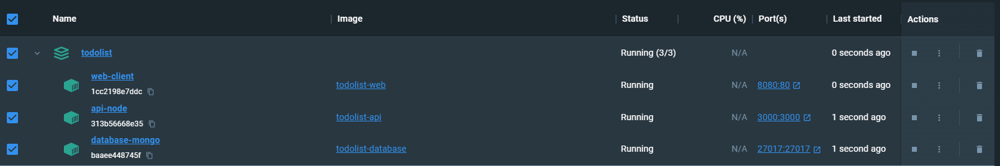
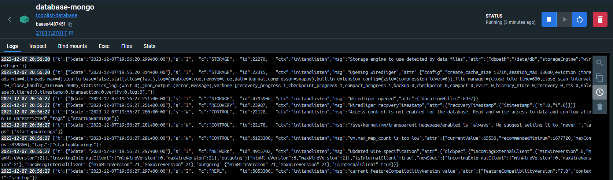
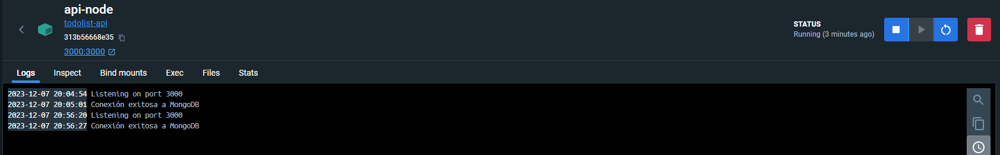
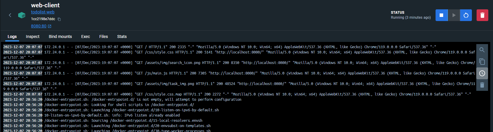
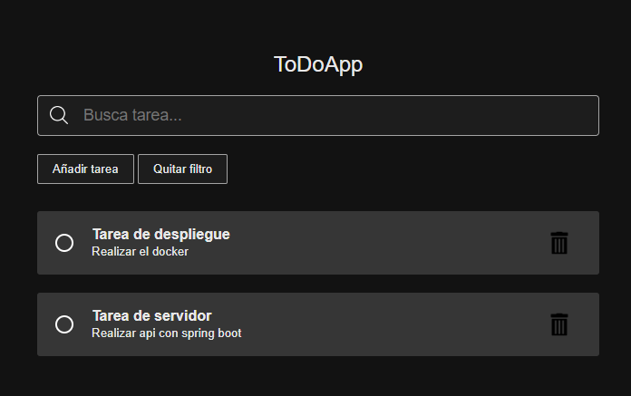

# TodoAppDespliegue

Este repositorio alberga un proyecto con el [enunciado del ejercicio](https://github.com/jocnunez/FP-2DAW-DAW) proporcionado por el profesor como parte del curso de Desarrollo Web. Es importante destacar que este proyecto tiene como objetivo principal ofrecer un espacio de práctica y aprendizaje, brindando la oportunidad de aplicar los conocimientos adquiridos en el aula y mejorar las habilidades en el despliegue de aplicaciones web.

## Descripción del proyecto

El proyecto TodoApp es una aplicación de gestión de tareas (todo list) que se compone de tres componentes principales: `api`, `client`, y `database`.

## Estructura del Proyecto

### Carpeta `api`

La carpeta `api` alberga la parte del backend de la aplicación, construida en Node.js utilizando el framework Express. Aquí se encuentran los siguientes archivos y carpetas:

- **`index.js`**: Archivo principal que sirve como punto de entrada para el servidor de la API.
- **`Dockerfile`**: Archivo de configuración para construir la imagen de Docker del servicio API.
- **`package.json`**: Archivo de configuración de Node.js que incluye las dependencias necesarias.
- **`exceptions`**: Carpeta que contiene archivos relacionados con el manejo de excepciones y errores de la API.

### Carpeta `client`

La carpeta `client` contiene la parte del frontend de la aplicación. Este componente se ha construido utilizando tecnologías web modernas y se sirve a través de Nginx. Aquí se encuentran los archivos y carpetas clave:

- **`Dockerfile`**: Archivo de configuración para construir la imagen de Docker del servicio de cliente.
- *(Otros archivos y carpetas específicos del frontend)*

### Carpeta `database`

En la carpeta `database` se encuentra la configuración relacionada con la base de datos de la aplicación, que utiliza MongoDB. Aquí se encuentran los archivos y carpetas importantes:

- **`data`**: Carpeta que contiene datos iniciales para la base de datos.
- **`Dockerfile`**: Archivo de configuración para construir la imagen de Docker del servicio de base de datos.
- **`mongo-init.js`**: Script de inicialización que carga datos iniciales en la base de datos MongoDB.

### Archivo `docker-compose.yaml`

En la raíz del proyecto, el archivo `docker-compose.yaml` se encarga de orquestar y levantar los tres servicios de la aplicación: `api`, `client` y `database`.

## Endpoints

| Endpoint            | Método | Descripción                                            | Casos de Error                                              |
|---------------------|--------|--------------------------------------------------------|-------------------------------------------------------------|
| `/todos`            | GET    | Obtener todas las tareas                                | -                                                           |
| `/todos/:id`        | GET    | Obtener una tarea por ID                                | - ID no válido (400) - Tarea no encontrada (404)                                        |
| `/todos/search/:search` | GET | Buscar tareas por texto                                | - No se encuentran tareas con el texto especificado (404)    |
| `/todos`            | POST   | Crear una nueva tarea                                   | - Título o descripción faltante (400)                       |
| `/todos/:id`        | PUT    | Actualizar el estado de una tarea por ID                | - ID no válido (400)                                                                                       - Estado no especificado (400)                               |
| `/todos/:id`        | DELETE | Eliminar una tarea por ID                               | - ID no válido (400)      - Tarea no encontrada    (404)                               |
|                     |        |                                                        |           |

## Contenedorores

En esta sección, se presentan capturas de pantalla de los contenedores ejecutándose en el entorno Docker. Estas imágenes ofrecen una visión detallada de la salud y el rendimiento de los componentes clave de la aplicación TodoApp: la API (`api-node`), el cliente (`web-client`), y la base de datos (`database-mongo`). Observar los registros de los contenedores proporciona una valiosa perspectiva sobre el funcionamiento interno de cada servicio, permitiendo una fácil identificación y resolución de posibles problemas.

### Contenedor mongo

En esta captura se presentan los registros de la base de datos. Aquí se pueden examinar consultas, conexiones y cualquier mensaje de relevancia para evaluar la salud y el rendimiento del sistema de almacenamiento de datos.

### Contenedor Api (node)

En esta captura, se exhiben los registros de la API. Se podrá consultar los mensajes de inicio, solicitudes entrantes y posibles errores para garantizar un funcionamiento fluido.

### Contenedor client (nginx)

La captura ofrece una visión detallada de los registros del cliente, resaltando la interacción con la interfaz de usuario. Se presta atención a eventos relevantes, como solicitudes HTTP y eventos del lado del cliente.

## Vista Previa WEB

En esta pantalla, se presenta una tarea específica de la aplicación TodoApp, con un diseño simple y centrado en la tarea seleccionada. 

## Instrucciones de Uso

1. Clona el repositorio desde [URL del Repositorio](https://github.com/Danniellgm03/TodoAppDespliegue).
2. Navega a la carpeta raíz del proyecto.
3. Ejecuta `docker-compose up` para iniciar los servicios.

¡Tu aplicación TodoApp estará lista para ser utilizada!
